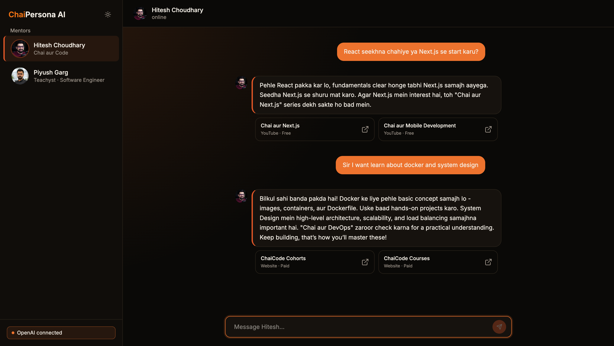

# ChaiPersona AI

An AI-powered chat experience that simulates conversations with two Indian coding educators **Hitesh Choudhary** and **Piyush Garg** built for the GenAI with JS 2026 assignment.

Switch between personas mid-conversation, get responses grounded in each mentor's real teaching style, and receive genuine content recommendations pulled from their actual YouTube series, courses, and cohorts.

**Live Website:** <https://persona.kevinrozario.com>  
**Detailed Methodology:** See [DOCUMENTATION](./DOCUMENTATION.md)



# Features

- **Dual persona chat** - Hitesh Choudhary and Piyush Garg, each with a distinct voice, teaching philosophy, and system prompt built from real public research.
- **Bring Your Own Key (BYOK)** - supports both Anthropic Claude and OpenAI; keys are validated on connect and kept only for the browser session, never stored server-side.
- **Real-time streaming responses** - via Server-Sent Events (SSE) replies appear token by token, not as a single blocking wait.
- **Context-aware conversations** - a sliding window of recent messages plus a rolling AI-generated summary keeps long conversations coherent without unbounded token growth.
- **Grounded content references** - when a question matches something a persona has actually made (a course, series, or video), the reply includes a real, verified link and never a hallucinated one.
- **Prompt injection resistant** - both personas are hardened against attempts to override instructions, extract the system prompt, or force a jailbreak.
- **Light and dark themes** - built around a warm chai-inspired color palette.
- **Fully responsive** - usable on mobile and desktop.

# Tech Stack

## Client

- React + TypeScript (Vite)
- Tailwind CSS v4
- react-markdown for formatted responses

## Server

- Node.js + Express + TypeScript
- Anthropic SDK + OpenAI SDK (dispatched based on user's selected provider)
- Server-Sent Events for streaming
- No database; conversation state lives client-side per session. Only the API layer is server-managed.

## Deployment

- Client: Vercel
- Server: Render

# Project Structure

```text
chai-persona-ai/
│
├── client/                          # React + TypeScript frontend (Vite)
│   ├── public/
│   │   └── favicon.svg
│   ├── src/
│   │   ├── components/
│   │   │   ├── ApiKeyModal.tsx
│   │   │   ├── ChatWindow.tsx
│   │   │   ├── Composer.tsx
│   │   │   ├── ConnectionStatus.tsx
│   │   │   ├── MessageBubble.tsx
│   │   │   ├── PersonaCard.tsx
│   │   │   ├── ReferenceCard.tsx
│   │   │   ├── Sidebar.tsx
│   │   │   ├── ThemeToggle.tsx
│   │   │   └── TypingIndicator.tsx
│   │   ├── hooks/
│   │   │   ├── useApiKey.ts
│   │   │   ├── useChat.ts
│   │   │   ├── useSSEStream.ts
│   │   │   └── useTheme.ts
│   │   ├── personas/
│   │   │   └── personaMeta.ts
│   │   ├── types/
│   │   │   └── chat.ts
│   │   ├── utils/
│   │   │   └── contextWindow.ts
│   │   ├── index.css
│   │   ├── App.tsx
│   │   └── main.tsx
│   ├── index.html
│   ├── package.json
│   ├── pnpm-lock.yaml
│   ├── tsconfig.json
│   ├── tsconfig.app.json
│   ├── tsconfig.node.json
│   ├── vite.config.ts
│   ├── eslint.config.js
│   └── README.md
│
├── server/                          # Node + Express + TypeScript backend
│   ├── src/
│   │   ├── config/
│   │   │   └── env.ts
│   │   ├── middlewares/
│   │   │   └── error.middleware.ts
│   │   ├── personas/
│   │   │   ├── hitesh.prompt.ts
│   │   │   ├── hitesh.catalog.ts
│   │   │   ├── piyush.prompt.ts
│   │   │   ├── piyush.catalog.ts
│   │   │   └── index.ts
│   │   ├── routes/
│   │   │   ├── chat.route.ts
│   │   │   └── validateKey.route.ts
│   │   ├── services/
│   │   │   ├── providers/
│   │   │   │   ├── anthropicProvider.ts
│   │   │   │   └── openaiProvider.ts
│   │   │   ├── contentMatcher.ts
│   │   │   ├── keyValidator.ts
│   │   │   ├── llmClient.ts
│   │   │   ├── streamHandler.ts
│   │   │   └── summarizer.ts
│   │   ├── types/
│   │   │   └── chat.ts
│   │   ├── utils/
│   │   │   ├── apiError.util.ts
│   │   │   ├── apiResponse.util.ts
│   │   │   └── asyncHandler.util.ts
│   │   └── index.ts
│   ├── package.json
│   ├── pnpm-lock.yaml
│   ├── pnpm-workspace.yaml
│   └── tsconfig.json
│
├── DOCUMENTATION.md
├── README.md
└── LICENSE
```

# Getting Started

## Prerequisites

- Node.js 22+ (project developed and tested on Node 24)
- pnpm (`corepack enable` if not already installed)
- An Anthropic or OpenAI API key (used at runtime via BYOK; not needed to run the project itself)

## 1. Clone the repository

```bash
git clone https://github.com/Kevin-Rozario/chai-persona-ai.git
cd chai-persona-ai
```

## 2. Set up the server

```bash
cd server
pnpm install
cp .env.example .env
```

Edit `.env`:

```text
PORT=5000
NODE_ENV="development"
CLIENT_ORIGIN="http://localhost:5173"

# Optional - local dev-only fallback keys
# Not required as the app uses BYOK (bring your own key) at runtime
ANTHROPIC_API_KEY=
OPENAI_API_KEY=
```

Run the server:

```bash
pnpm run dev
```

The server starts on `http://localhost:5000`.

Confirm it's running:

```bash
curl http://localhost:5000

# {"success":true,"statusCode":200,"message":"Server is running","data":{},"timestamp":"2026-07-05T17:33:37.652Z"}
```

## 3. Set up the client

```bash
cd client
pnpm install
cp .env.example .env
```

Edit `.env`:

```text
VITE_BACKEND_API_URL="http://localhost:5000"
```

Visit `http://localhost:5173` in your browser to see the client running.

## 4. Connect an API key

Open the app, click the connection status pill in the sidebar, choose Claude or OpenAI, and paste a real API key. It's validated immediately against the provider before you can start chatting.

# Build for Production

```bash
# Server
cd server
pnpm run build
node dist/index.js

# Client
cd client
pnpm run build
```

# Environment Variables Reference

## Server (`server/.env`)

| Variable            | Required         | Description                                     |
| ------------------- | ---------------- | ----------------------------------------------- |
| `PORT`              | No               | Defaults to 5000                                |
| `NODE_ENV`          | No               | `development` or `production`                   |
| `CLIENT_ORIGIN`     | Yes (production) | Allowed CORS origin - your deployed client URL  |
| `OPENAI_API_KEY`    | No               | Local dev-only fallback; not used in production |
| `ANTHROPIC_API_KEY` | No               | Local dev-only fallback; not used in production |

## Client (`client/.env`)

| Variable               | Required | Description                                                     |
| ---------------------- | -------- | --------------------------------------------------------------- |
| `VITE_BACKEND_API_URL` | Yes      | Full base URL of the deployed/local server, including `/api/v1` |

# Known Limitations

- Catalog-based content matching uses keyword/topic overlap, not semantic search; very specific questions may not surface a matching video even if one exists. (See [DOCUMENTATION.md](./DOCUMENTATION.md) for the reasoning and tradeoffs.)
- Conversation history is not persisted across page refreshes; this was a deliberate scope decision, not an oversight. (See [DOCUMENTATION.md](./DOCUMENTATION.md).)
- Free-tier hosting (Render) may take 30-60 seconds to wake up after inactivity.

# License

Built for the GenAI with JS 2026 assignment. Not affiliated with or endorsed by Hitesh Choudhary or Piyush Garg. This project simulates their public teaching style for educational purposes only. For any questions or concerns, please refer to the [LICENSE](./LICENSE) file.
